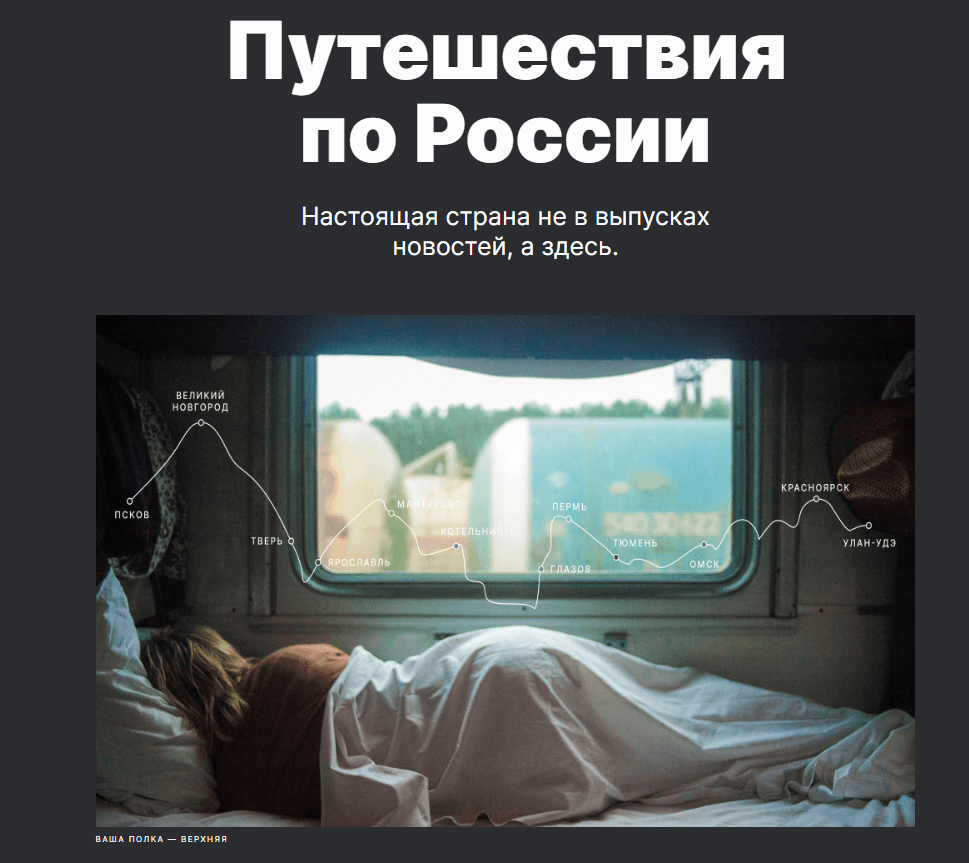

<h1>Учебный проект "Путешествие по России"</h1>

<a href="https://alexandrger.github.io/russian-travel/" target="blank">

</a>

<h2>Описание проекта</h2>

Данный [проект](https://alexandrger.github.io/russian-travel/) был сделан в рамках образовательной программы [Яндекс.Практикума.](https://practicum.yandex.ru/) Проект представляет собой создание отзывчиво-адаптивного одностраничного сайта на тему наиболее интересных мест в России для путешествий. Он корректно отображается на различных устройствах, будь то настольный компьютер, ноутбук, планшет, телефон.

<h2>Стек технологий</h2>


<h2>Инструкция по установке</h2>

```
Клонируем репозиторий:
git clone https://github.com/AlexandrGer/russian-travel.git
Открываем скачанный репозиторий любым редактором кода(PhpStorm, Visual Studio) и развлекаемся на своё усмотрение.
```

<h2>Методология и процесс создания</h2>

Работа была выполнена в 1 этап. <br>
В ней реализованы знания, навыки и техники, изученные за второй месяц обучения профессии веб-разработчика.<br>
В процессе работы над этим проектом, было сверстано 7 блоков по [макету](https://www.figma.com/file/5S2WSbEFL6awjVWJ0NWL8Q/Sprint-3_-Russia-_-desktop-%2B-mobile?type=design&node-id=28503-0&mode=design&t=LHEMSXr2LVqWmC6a-0), представленному на популярном онлайн-сервисе "Figma". Были использованы в качестве инструментов как технологии, изученные на первом месяце обучения (флекс-бокс верстка, позиционирование элементов), так и новые, освоенные на третьем курсе программы (Grid Layout).<br>
Наиболее сложной частью проекта, реализация которой заняла довольно много времени, можно считать оптимизацию сайта для корректного отображения информации на экранах устройств шириной от 320 до 1280 пикселей включительно и выше. Для решения поставленной задачи были введены брейкпоинты для экранов наиболее широко распространенных размеров (320, 768, 1024 и 1280 пикселей). Получившийся результат сверен с расширением Pixel Perfect. Код выстроен в соответствии с методологией БЭМ, все файлы сгруппированы исходя из структуры "Nested".

<h2>Усовершенствование кода</h2>

1. Код может быть сделан кроссбраузерным после освоения материала по подключению автопрефиксеров.<br>
2. Сделать англоязычную версию страницы.